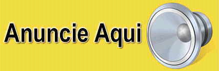

<html><head>

&#x1F920; Olá, eu sou o Vinicius. 

 

 <b>Um pouco mais sobre mim... </b><i>(Aperta aí)</i> 

&#x1F4BB;Técnico em Informática formado no Colégio SATC   
&#x1F4BB;Cursando engenharida computação na UNISATC   
&#x1F575;Estagiário na empresa <a href = "https://www.agpr5.com/">AGPR5 +20</a>  
&#x1F5FA;Cricíuma-SC	

 

&#x1F4F2;Me segue no instagram!
 

  

 

&#x1F4D6;Áreas de conhecimento

 <b>Algumas linguagens e áreas de maior conhecimento!</b>

&#x1F4BB;C++ voltado para parte de Arduino; 
&#x1F4BB;C# Desktop; 
&#x1F4BB;Visual Basic - VB Desktop; 
&#x1F4BB;Linguagem de Consulta Estrutural - SQL;  
&#x1F4BB;Internet das Coisas - IoT;  
&#x1F4BB;Eletrônica básica;  
&#x1F4BB;Elétrica básica;  

 

&#X1F6E0;Projetos

 <b>Projetos realizados!</b>

Esses projetos foram realizados em duplas, tendo como parceiro meu colega <a href="https://github.com/victorbonomi16">Victor Bonomi.</a>  
&#x1F4CC;Bem Saude - Um app mobile voltado para área da saúde, sendo possível calcular seu IMC e em seguida lhe recomendando uma sequência de exercícios; <i>Realizado durante o curso Técnico de Informática</i> 
 
&#x1F4CC;Falling the Grotto - Um game baseado no Hill Climb Race, com intuito de gerar entretenimento para jogador; <i>Realizado durante o curso Técnico de Informática</i> 
 
&#x1F4CC;Smart House Dog - Uma comodidade para o dono e um conforto para seu cãozinho. Esse projeto(TCC) foi desenvolvido para as pessoas que possuem uma rotina atarefa e como consequência deixam seu cãozinho com excesso de comida em seus recipientes. Pensando nisso a SmartHouse Dog é uma casa de cachorro e  tem como vantagem a alimentação(Agua e Ração) de forma automática, sendo determinada um horário através de seu SmartPhone. <i>Realizado durante o curso Técnico de Informática</i>

 

&#X1F47D;Acompanhe

  <a href="https://github.com/ViniciusDamiani">
  
  

&#x1F4D6;<i>"Não é a linguagem de programação que define o programador, mas sim sua lógica.  
by: David Ribeiro Guilherme"</i> 

<a href = "https://api.whatsapp.com/send?phone=5548996301654&text=Vinicius%20Damiani">

</body></html>
